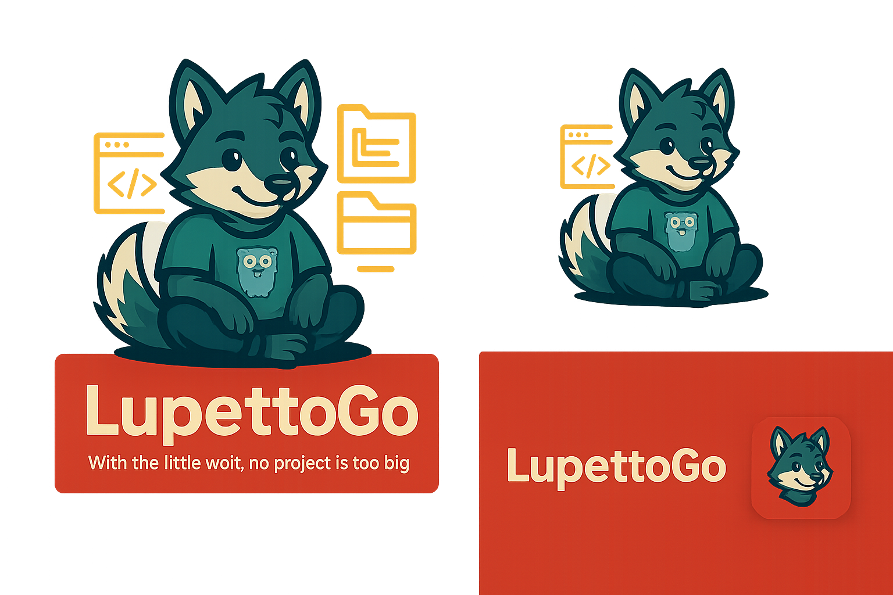

<p align="center">
  
</p>

<h1 align="center">LupettoGo 🐺</h1>
<p align="center"><i>With the little wolf, no project is too big.</i></p>

---

# LupettoGo

🐺 **LupettoGo** is a CLI tool to scaffold a production-ready Golang SaaS starter project.

## ✨ Features

- Clean architecture Golang boilerplate
- CLI-powered project initialization
- Ready to extend with auth, RBAC, multi-tenant

## 🚀 Getting Started

```bash
go run main.go init myproject
cd myproject
go run main.go
```

Visit `http://localhost:8080` to see it in action.

---

With the little wolf, no project is too big.
